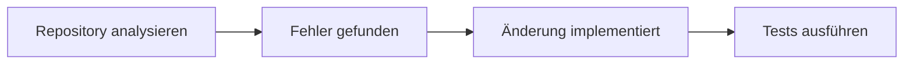

TencentDB Agent Memory soll KI-Agenten ein nachvollziehbares Langzeitgedächtnis geben. Das Open-Source-Projekt kombiniert SQLite, Vektorsuche und eine vierstufige Speicherstruktur.

## Was ist TencentDB Agent Memory?

TencentDB Agent Memory ist ein unter der MIT-Lizenz veröffentlichtes Speichersystem für KI-Agenten. Entwickelt wird es vom TencentDB Agent Memory Team. Das Projekt richtet sich vor allem an Agenten, die über längere Zeiträume arbeiten, Werkzeuge aufrufen und Informationen aus früheren Sitzungen wiederverwenden sollen.

Ein normales Sprachmodell besitzt zunächst kein dauerhaftes Gedächtnis. Es verarbeitet die Informationen, die ihm innerhalb seines aktuellen Kontextfensters übergeben werden. Ist eine Unterhaltung beendet oder der Kontext zu groß, stehen frühere Details nicht automatisch weiter zur Verfügung.

Entwickler lösen dieses Problem häufig, indem sie Gesprächsverläufe speichern, in einzelne Textabschnitte zerlegen und über eine Vektordatenbank durchsuchen. TencentDB Agent Memory verfolgt einen stärker strukturierten Ansatz. Es speichert nicht nur Textfragmente, sondern ordnet die Inhalte verschiedenen Gedächtnisebenen zu.

Das Projekt kombiniert dazu zwei Komponenten:

- ein symbolisches Kurzzeitgedächtnis für laufende Aufgaben
- ein hierarchisches Langzeitgedächtnis für Informationen aus mehreren Sitzungen

Damit soll ein Agent nicht möglichst viel speichern, sondern im richtigen Moment die passende Information erhalten.

## Warum KI-Agenten ein eigenes Gedächtnis brauchen

Bei einer einfachen Chat-Anwendung kann es ausreichen, die letzten Nachrichten erneut an das Sprachmodell zu schicken. Bei langfristigen Agenten wächst der Kontext jedoch schnell.

Besonders viele Token verbrauchen:

- Suchergebnisse
- Quellcode und Dateiinhalte
- Terminalausgaben
- Fehlermeldungen
- Ergebnisse externer Werkzeuge
- lange Gesprächsverläufe

Werden diese Daten bei jedem Arbeitsschritt vollständig übertragen, steigen Kosten und Latenz. Gleichzeitig kann die Qualität sinken, weil wichtige Informationen zwischen Protokollen, Wiederholungen und nicht mehr relevanten Zwischenergebnissen untergehen.

Ein Gedächtnissystem soll deshalb drei Aufgaben übernehmen:

1. Relevante Informationen erkennen und speichern
2. Informationen verdichten, ohne ihre Herkunft vollständig zu verlieren
3. Passende Erinnerungen für eine neue Aufgabe wiederfinden

Gerade bei komplexeren Anwendungen aus der [KI](https://oliverjessner.at/category/ki/) und [Softwareentwicklung](https://oliverjessner.at/category/software-development/) wird Memory damit zu einer eigenen technischen Komponente.

## Vier Ebenen für das Langzeitgedächtnis

TencentDB Agent Memory organisiert langfristig gespeicherte Informationen als semantische Pyramide. Die Ebenen heißen L0 bis L3.

### L0: Conversation

Die unterste Ebene enthält den ursprünglichen Gesprächsverlauf. Sie dient als Beleg für die darüberliegenden Informationen.

Hier können beispielsweise vollständige Nachrichten, Zeitpunkte und Metadaten gespeichert werden. Muss der Agent später überprüfen, woher eine Information stammt, kann er bis zur ursprünglichen Unterhaltung zurückgehen.

### L1: Atom

Aus den Gesprächen extrahiert das System einzelne Fakten. Diese kleinsten Informationseinheiten werden als Atoms bezeichnet.

Ein Atom könnte beispielsweise lauten:

"Der Nutzer bevorzugt TypeScript für neue Backend-Projekte."

Die Information ist kompakter als der vollständige Gesprächsverlauf und lässt sich gezielter durchsuchen.

### L2: Scenario

Mehrere zusammengehörende Atoms werden zu Szenarien kombiniert. Ein Szenario beschreibt einen konkreten Zusammenhang, ein Projekt oder eine wiederkehrende Situation.

Dazu können beispielsweise die verwendete Programmiersprache, das Framework, technische Einschränkungen und bereits getroffene Entscheidungen gehören.

Die Szenarien werden als lesbare Markdown-Dateien gespeichert. Entwickler können damit nachvollziehen, welches Wissen das System aus vergangenen Unterhaltungen abgeleitet hat.

### L3: Persona

Die oberste Ebene enthält ein verdichtetes Profil. Dort können langfristige Präferenzen, Arbeitsweisen und Ziele zusammengeführt werden.

Bei einer neuen Anfrage muss der Agent dadurch nicht immer sämtliche Gespräche durchsuchen. Für allgemeine Entscheidungen kann zunächst die Persona ausreichen. Werden konkrete Details benötigt, kann das System schrittweise zu Scenario, Atom und Conversation zurückgehen.

Die Struktur lautet damit:

```text
L0 Conversation
      ↓
L1 Atom
      ↓
L2 Scenario
      ↓
L3 Persona
```

Dieser Drill-down ist ein wesentlicher Unterschied zu einem rein flachen Vektorspeicher. Eine gefundene Präferenz bleibt mit den Szenarien und Gesprächen verbunden, aus denen sie abgeleitet wurde.

## Kurzzeitgedächtnis mit Mermaid statt vollständiger Protokolle

Neben dem langfristigen Gedächtnis verwaltet TencentDB Agent Memory auch den Zustand laufender Aufgaben.

Ausführliche Werkzeugausgaben werden dafür aus dem aktiven Kontext ausgelagert und in Dateien unter `refs/*.md` gespeichert. Im Kontext des Agenten verbleibt nur eine kompaktere Darstellung des Arbeitsablaufs.

Dafür verwendet das Projekt Mermaid-Diagramme. Ein vereinfachter Aufgabenstatus könnte beispielsweise so aussehen:



Die einzelnen Knoten können mit einer `node_id` versehen werden. Benötigt der Agent später die vollständige Terminalausgabe oder einen bestimmten Fehlertext, kann er über diese ID auf die ausgelagerte Datei zugreifen.

Der Ansatz ähnelt einem Inhaltsverzeichnis für den aktuellen Arbeitskontext. Das Modell sieht zunächst nur die Struktur und lädt Details erst dann, wenn sie tatsächlich benötigt werden.

## Lokale Speicherung mit SQLite und sqlite-vec

In der Standardkonfiguration verwendet TencentDB Agent Memory eine lokale SQLite-Datenbank zusammen mit der Erweiterung `sqlite-vec`.

SQLite speichert die strukturierten Daten. `sqlite-vec` ermöglicht eine semantische Suche über Vektoren beziehungsweise Embeddings. Zusätzlich unterstützt das Projekt eine Kombination aus:

- klassischer Volltextsuche mit BM25
- semantischer Vektorsuche
- Reciprocal Rank Fusion zur Zusammenführung der Ergebnisse

Dadurch kann das System sowohl nach exakten Begriffen als auch nach inhaltlich ähnlichen Erinnerungen suchen.

Die höheren Ebenen wie Szenarien, Personas und Mermaid-Diagramme bleiben als lesbare Dateien erhalten. Das erleichtert die Fehlersuche, weil die gespeicherten Ableitungen nicht ausschließlich innerhalb einer Datenbank verborgen sind.

## TencentDB Agent Memory in OpenClaw installieren

Die einfachste Integration bietet das Projekt derzeit für OpenClaw. Das Plugin wird über die OpenClaw-CLI installiert.

```bash
openclaw plugins install @tencentdb-agent-memory/memory-tencentdb
openclaw gateway restart
```

Anschließend wird das Plugin in der OpenClaw-Konfiguration aktiviert.

```json
{
    "memory-tencentdb": {
        "enabled": true
    }
}
```

Standardmäßig übernimmt das Plugin danach mehrere Arbeitsschritte automatisch:

- Gespräche erfassen
- einzelne Fakten extrahieren
- Szenarien erzeugen
- eine Persona aktualisieren
- passende Erinnerungen vor einer neuen Antwort abrufen

Die Komprimierung des kurzfristigen Kontexts muss separat aktiviert werden.

```json
{
    "memory-tencentdb": {
        "config": {
            "offload": {
                "enabled": true
            }
        }
    }
}
```

Zusätzlich muss OpenClaw das Plugin als Context Engine verwenden.

```json
{
    "plugins": {
        "slots": {
            "contextEngine": "memory-tencentdb"
        }
    }
}
```

Nach einem OpenClaw-Update kann es notwendig sein, das mitgelieferte Patch-Skript erneut auszuführen. Es sorgt dafür, dass Werkzeugausgaben nach einem Tool-Aufruf ausgelagert und später wiedergefunden werden können.

```bash
bash scripts/openclaw-after-tool-call-messages.patch.sh
```

Neben OpenClaw unterstützt das Projekt Hermes über einen Gateway-Adapter. Dafür steht auch eine Docker-basierte Installation zur Verfügung.

## Was "vollständig lokal" tatsächlich bedeutet

Die Bezeichnung "lokal" sollte bei solchen Projekten genau betrachtet werden.

Die eigentliche Datenbank kann vollständig auf dem eigenen Rechner oder Server betrieben werden. Gespräche, Atoms, Szenarien, Personas und Vektoren müssen daher nicht zwingend an einen externen Datenbankanbieter übertragen werden.

Für die Extraktion und Verarbeitung der Erinnerungen wird jedoch weiterhin ein Sprachmodell benötigt. Dieses Modell kann lokal betrieben werden. Die Konfiguration unterstützt aber auch OpenAI-kompatible Endpunkte und externe Modellanbieter.

Ähnliches gilt für Embeddings. Sie können je nach Konfiguration lokal oder über eine externe API erzeugt werden.

Aus [Privacy](https://oliverjessner.at/category/privacy/)-Sicht muss deshalb nicht nur der Speicherort der Datenbank geprüft werden. Entscheidend ist auch, welche Inhalte an das verwendete Sprachmodell und den Embedding-Dienst übertragen werden.

## Welche Verbesserungen Tencent für OpenClaw angibt

Das Projekt nennt mehrere Benchmark-Ergebnisse für die Integration mit OpenClaw.

| Benchmark                 |         OpenClaw | Mit TencentDB Agent Memory |
| ------------------------- | ---------------: | -------------------------: |
| WideSearch Erfolgsrate    |             33 % |                       50 % |
| WideSearch Tokenverbrauch | 221,31 Millionen |            85,64 Millionen |
| SWE-bench Erfolgsrate     |           58,4 % |                     64,2 % |
| AA-LCR Erfolgsrate        |           44,0 % |                     47,5 % |
| PersonaMem Genauigkeit    |             48 % |                       76 % |

Bei WideSearch entspricht das laut Projekt einer Reduktion des Tokenverbrauchs um 61,38 Prozent. Die Tests sollen über längere, zusammenhängende Sitzungen erfolgt sein. Beim SWE-bench wurden laut Dokumentation jeweils 50 Aufgaben nacheinander innerhalb einer Sitzung ausgeführt.

Die Zahlen sind interessant, sollten aber als Ergebnisse des Projektteams betrachtet werden. Sie ersetzen keine unabhängige Evaluation und lassen sich nicht automatisch auf andere Agenten, Modelle oder Arbeitsabläufe übertragen.

## Die Stärken des Ansatzes

Die interessanteste Eigenschaft von TencentDB Agent Memory ist nicht die Verwendung einer Vektordatenbank. Diese gehört bei Gedächtnissystemen für KI-Agenten inzwischen zu den üblichen Bausteinen.

Spannender ist die Verbindung mehrerer Speicherebenen.

Ein Agent kann mit einer verdichteten Persona arbeiten, ohne die darunterliegenden Fakten vollständig zu verlieren. Bei Bedarf lässt sich nachvollziehen, aus welchem Szenario und welcher Unterhaltung eine Information stammt.

Weitere praktische Vorteile sind:

- SQLite benötigt keinen eigenen Datenbankserver
- Markdown-Dateien können direkt kontrolliert und bearbeitet werden
- Mermaid-Diagramme machen laufende Aufgaben nachvollziehbar
- die hybride Suche verbindet Schlüsselwörter mit semantischer Ähnlichkeit
- Rohdaten bleiben mit den daraus erzeugten Zusammenfassungen verknüpft
- das Projekt steht unter der MIT-Lizenz

Gerade bei der Fehlersuche ist diese Nachvollziehbarkeit hilfreich. Liefert der Agent eine falsche Erinnerung, kann untersucht werden, ob bereits das Atom falsch extrahiert, das Szenario ungenau zusammengefasst oder die falsche Persona-Information abgerufen wurde.

## Grenzen und offene Fragen

Auch ein hierarchisches Gedächtnis löst nicht automatisch alle Probleme langfristiger KI-Agenten.

Die Qualität hängt weiterhin davon ab, ob das verwendete Sprachmodell Fakten korrekt erkennt und zusammenfasst. Eine falsche Ableitung kann in höhere Ebenen übernommen und später erneut verwendet werden.

Zusätzlich entstehen Fragen zur Aktualisierung. Präferenzen und Projektinformationen können sich ändern. Ein gutes Memory-System muss deshalb nicht nur speichern, sondern auch Widersprüche erkennen, alte Informationen ersetzen und nicht mehr benötigte Daten löschen.

Bei TencentDB Agent Memory ist für die lokalen L0- und L1-Daten standardmäßig keine automatische Löschung vorgesehen. Der Konfigurationswert für die Aufbewahrungsdauer steht zunächst auf `0`, was einer unbegrenzten Speicherung entspricht.

**Hinweis:** Wer das System mit persönlichen, vertraulichen oder geschäftlichen Inhalten verwendet, sollte Speicherort, Zugriffsrechte, Backups und Aufbewahrungsfristen bewusst konfigurieren. Ein lokal gespeichertes Gedächtnis kann mit der Zeit deutlich sensiblere Informationen enthalten als ein gewöhnlicher Chatverlauf.

Auch die Komprimierung des kurzfristigen Kontexts benötigt derzeit einen zusätzlichen Patch für OpenClaw. Nach Updates kann dieser erneut erforderlich sein. Das macht die Funktion weniger wartungsfrei als eine vollständig über stabile Plugin-Schnittstellen umgesetzte Integration.

## Für wen eignet sich TencentDB Agent Memory?

Das Projekt ist vor allem für Entwickler interessant, die bereits mit OpenClaw oder Hermes arbeiten und ihre Agenten über längere Sitzungen hinweg einsetzen.

Mögliche Anwendungsfälle sind:

- Coding-Agenten, die Projektregeln und frühere Entscheidungen behalten sollen
- Recherche-Agenten, die Quellen und Zwischenergebnisse über mehrere Sitzungen verwalten
- persönliche Assistenten mit langfristigen Präferenzen
- interne Agenten für wiederkehrende Unternehmensprozesse
- experimentelle Multi-Agenten-Systeme mit gemeinsam genutztem Wissen

Für einen einfachen Chatbot mit kurzen Unterhaltungen dürfte die zusätzliche Architektur dagegen häufig unnötig sein. Der Nutzen entsteht vor allem dann, wenn ein Agent regelmäßig Kontext verliert, alte Entscheidungen erneut erfragen muss oder große Mengen an Werkzeugausgaben verarbeitet.

## Fazit

TencentDB Agent Memory behandelt das Gedächtnis eines KI-Agenten nicht als ungeordnete Sammlung von Textfragmenten. Gespräche werden schrittweise in Fakten, Szenarien und ein langfristiges Profil überführt. Gleichzeitig lassen sich die verdichteten Informationen bis zu den ursprünglichen Daten zurückverfolgen.

Die Kombination aus SQLite, Vektorsuche, lesbaren Markdown-Dateien und Mermaid-Diagrammen ist technisch nachvollziehbar und vergleichsweise transparent. Besonders interessant ist der Versuch, Token einzusparen, ohne sämtliche Details unwiderruflich in einer einzigen Zusammenfassung zu verlieren.

Ob sich die versprochenen Verbesserungen in realen Projekten bestätigen, hängt vom eingesetzten Modell, den gespeicherten Inhalten und dem jeweiligen Agenten ab. Als Open-Source-Grundlage für ein lokales und überprüfbares Agentengedächtnis ist TencentDB Agent Memory dennoch ein Projekt, das sich für praktische Experimente anbietet.

## Quellen und weiterführende Links

Projekt und Dokumentation:

https://github.com/TencentCloud/TencentDB-Agent-Memory

Ausgangsbericht:

https://www.marktechpost.com/2026/05/23/tencent-open-sources-tencentdb-agent-memory-a-4-tier-local-memory-pipeline-for-ai-agents/
